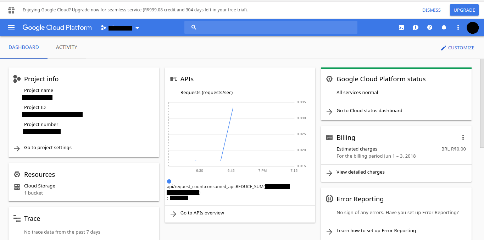
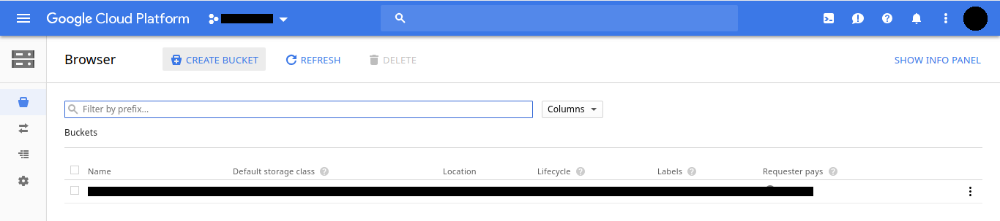
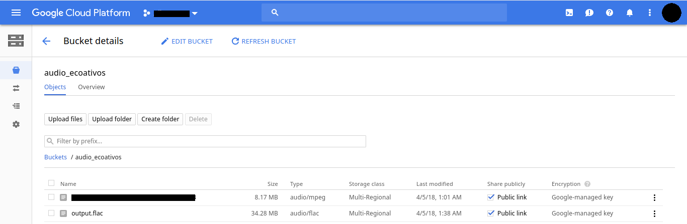

Here I was with a twenty-minute-long audio for transcription. I though I was up to the task given my above-average (but not that great -- [check it here](https://10fastfingers.com/user/292774/)) typing speed.

**I've failed miserably**.

After 30 minutes typing I realized how Herculean the task would be. So I began to look for a automatic way to do it.

I've came across several Windows payware programs and I was starting to think it had been a mistake this whole idea -- as this transcription thing would be just an one-time-only kind-of job It would be easier to just manual transcript!

Then I've found [Google Cloud Speech-to-Text](https://cloud.google.com/speech-to-text/). At first It seemed that the homepage demo would already satisfy my needs but it didn't work out because my audio duration (the demo is capped by 30-sec audio duration). So I had to create a Google Cloud Account to start using the API. It's starts with $999.99 credit and one year free trial.

The dashboard looks like this:


#Step-by-step on using Google Speech API in Linux

In this simple tutorial I'll show how to invoke the asynchronous method `speech.longrunningrecognize` (used for long files transcription). Method documentation [here](https://cloud.google.com/speech-to-text/docs/reference/rest/v1/speech/longrunningrecognize).

1. Have at hand the audio file to be transcribed -- a lossless compression-type file is recommended (like FLAC, [see more here](https://www.magellanic-clouds.com/blocks/en/guide/cloud-speech-api-audio-encoding/)). Using `ffmpeg` is easy to convert a MP3 audio file into FLAC:

` $ ffmpeg -i input.mp3 output.flac`

2. Install the Google Cloud SDK ([see here](https://cloud.google.com/sdk/downloads)).

3. Create a [Bucket](https://cloud.google.com/storage/docs/json_api/v1/buckets) in Google Cloud dashboard (in _Cloud Storages_ near _Resources_ and then CREATE BUCKET):



Click the newly created bucket to start adding files into it.

4. Upload the FLAC file in the bucket, in the example below _output.flac_ was added (make sure to mark **share publicly** in **Public link**)



5. Create a json file with the speech.longrunningrecognize configuration properties

```javascript
//sync-request.json
{
  "config": {
      "encoding":"FLAC",
      "sampleRateHertz": 44100,
      "languageCode": "pt-BR",
      "enableWordTimeOffsets": false
  },
  "audio": {
      "uri":"gs://audio_ecoativos/output.flac"
  }
}
```
In my  example I saved the configuration file as `sync-request.json`. The language is 'pt-BR' (available languages [here](https://cloud.google.com/speech-to-text/docs/languages)). Pay close attention in the `uri` property, it is constructed as follows:

``
"gs://<BUCKET NAME>/<AUDIO FILE NAME>"
``

6. Now we can invoke the API method as follows:

```console
$ curl -s -H "Content-Type: application/json" -H "Authorization: Bearer "$(gcloud auth print-access-token) https://speech.googleapis.com/v1/speech:longrunningrecognize -d @sync-request.json
```

The method will return a operation id (something like `4842921990869741351`) and the server will begin to process the audio asynchronously.

7. To follow the percentage of execution -- and get the result when it is done -- use the `operations` method with the correct operation id.

```console
$ curl -s -H "Content-Type: application/json" -H "Authorization: Bearer "$(gcloud auth print-access-token) https://speech.googleapis.com/v1/operations/<YOUR OPERATION ID HERE>
```
The response body (when at 100%) will be something like this:

```javascript
{
  "name": "4842921990869741341",
  "metadata": {
    "@type": "type.googleapis.com/google.cloud.speech.v1.LongRunningRecognizeMetadata",
    "progressPercent": 100,
    "startTime": "2018-04-05T04:38:55.575936Z",
    "lastUpdateTime": "2018-04-05T04:45:36.850750Z"
  },
  "done": true,
  "response": {
    "@type": "type.googleapis.com/google.cloud.speech.v1.LongRunningRecognizeResponse",
    "results": [
      {
        "alternatives": [
          {
            "transcript": "papo cabeça e isso mesmo e hoje eu converso sobre um projeto gente lançado pelo criança e consumo do Instituto Alana esse projeto propõe reflexões a educadores sobre sustentabilidade e consumo consciente E aí então quem vai conversar hoje é a diretora de advocacy do Alana é a Isabela Henriques sobre o projeto Eco ativos e ela já está na linha Oi Isabela Boa tarde seja bem vinda obrigado é um prazer está falando com vocês que delícia Isabelle dá mais para falar sobre um projeto tão bacana já então quero que você comece já explicando para gente o que é o eco ativos",
            "confidence": 0.95867443
          }
        ]
      },

      // ...
```
Check out the response body format [here](https://cloud.google.com/speech-to-text/docs/reference/rest/v1/speech/recognize#SpeechRecognitionResult).

I hope this ~~tiny~~ tutorial can be useful!
